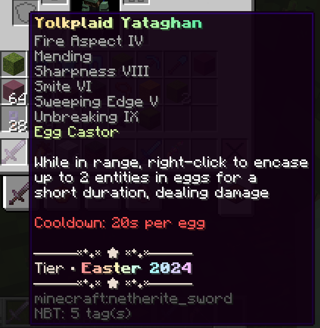

Custom items that are actually written custom. This plugin is designed for
developers who would like to write custom items in Java/Kotlin with a simple streamlined process (Aka. Me)

Some things you'll find here:
- Custom items are divided up by their individual classes for their unique abilities.
- Events are fired when the item is used
- Custom item classes are automatically instantiated at runtime requiring the developer to do nothing but create the class for the custom item and immediately get to writing.

